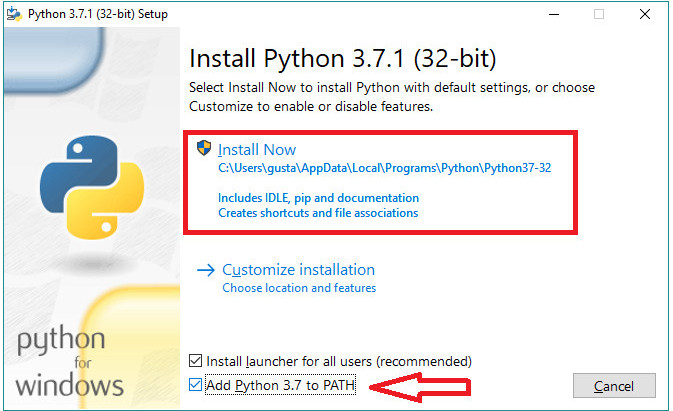
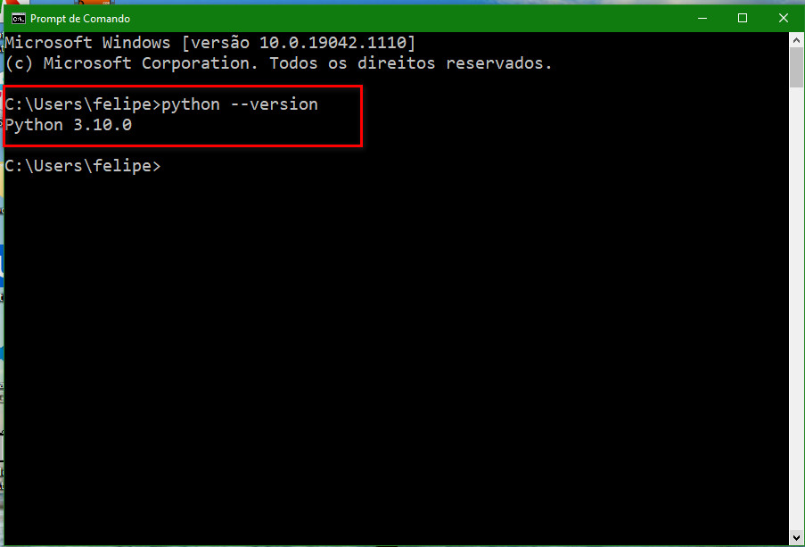
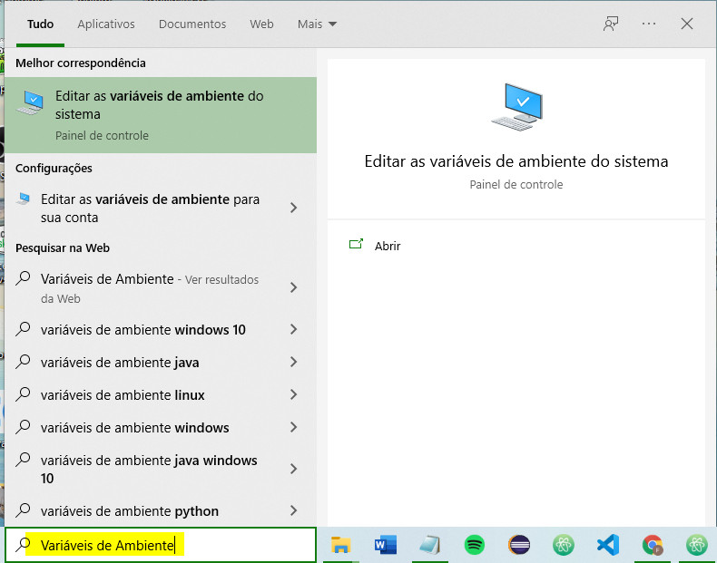
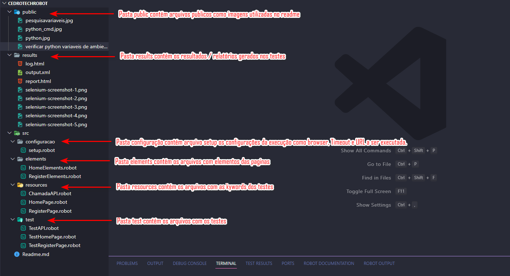

<h1 .align="center">
  Projeto Cedro Tech  Robot FrameWork
</h1>

## Sobre

O Projeto **"CedroTechRobot"** de automação de testes.

## Pré-requisitos

  - [Download Visual Studio Code](https://code.visualstudio.com/download)
  - [Download Python ](https://www.python.org/downloads/)
  - [Download ChromeDriver](https://chromedriver.chromium.org/downloads) 
  - [Download ChromeDriver versões mais atuais](https://googlechromelabs.github.io/chrome-for-testing/#stable)
  - [Download Geckodriver](https://github.com/mozilla/geckodriver/releases)
  - [Download Driver Edge](https://developer.microsoft.com/en-us/microsoft-edge/tools/webdriver/)
  - [Download Driver Safari](https://webkit.org/blog/6900/webdriver-support-in-safari-10/)

## Instalação
**Instalação do Python**

1 - Baixar o Python em: 
https://www.python.org/downloads/  
 
2 - Durante a instalação do Python é importante selecionar a opção Add Python to PATH: 
   
 
3 - Após baixar o Python verificar se ele realmente foi instalado, no Prompt de Comando digitar o comando: python --version   
  
 
4 - Verificar se o Python se encontra configurado nas variáveis de ambiente do Windows (para acessar as variáveis de ambiente basta digitar variáveis de sistema na busca do Windows) 
    
    

 **Configurar os Drivers**  
1 - Fazer o download dos drivers 
  - ChromeDriver 
https://chromedriver.chromium.org/downloads
  - Geckodriver 
https://github.com/mozilla/geckodriver/releases
  - Edge 
https://developer.microsoft.com/en-us/microsoft-edge/tools/webdriver/
  - Safari 
https://webkit.org/blog/6900/webdriver-support-in-safari-10/ 

2 - Descompactar os arquivos e copiar 

3 - Abrir a pasta Script dentro da pasta do Python e colar os arquivos dos Drivers. 
 * Para pegar o caminho da pasta acesse as variáveis de ambiente do Windows lá você irá visualizar o caminho da pasta. 
  - Ex. :  C:\Users\XXXXUsuer\AppData\Local\Programs\Python\PythonXXX\Scripts\  

4 - Para verificar se o Python foi corretamente instalado, abra o pronpt de comando e digete: python --version  
  O sistema devera exibir a verão do Python instalada   

**Instalação do Robot FrameWork**

1 - No Prompt de Comando digitar o comando: 
  pip install robotframework   
2 - No Prompt de Comando digitar o comando: 
  pip install robotframework-seleniumlibrary   
3 - Para verificar se o robotframework foi corretamente instalado, abra o pronpt de comando e digete: robot --version 
  O sistema devera exibir a verão do robotframework instalada  
4 - No Prompt de Comando digitar o comando: 
  pip install robotframework-requests 

**Instalação do Visual Studio Code**

1 - baixar o Visual Studio Code em:
https://code.visualstudio.com/download   

2 - Abrir o Visual Studio Code acessar a opção Extensions no menu View (Ctrl+Shift+y) e instalar as Extensions:
  - Robot Framework Intellisense (Tomi Turtiainem)
  - RobotF Extension (KMK Labs)  

**Execução de um Cenário**

1 - Habilitar o Terminal no Visual Studio Code, (Ctrl+') ou no menu View opção terminal  

2 - Digitar o comando:
  - Para executar todos os testes: 
  robot -d ./results  src\test   
  - Para executar os cenarios de uma pagina expecifica: 
  robot -d ./results CedroTechRobot\test\XXXXXPage.robot
  - Para executar apenas um cenario: 
  robot -d ./results -t "@CenarioXX" src\test\XXXXXPage.robot
  - Para executar pela [TAG] ex. [Tags] Todos: 
  robot -d .\results -i Todos src/test  

**Mais Informações Sobre o Robot Framework**

- [Robot Framework](https://robotframework.org/)

**Projeto Robot Framework CEDRO**

   

